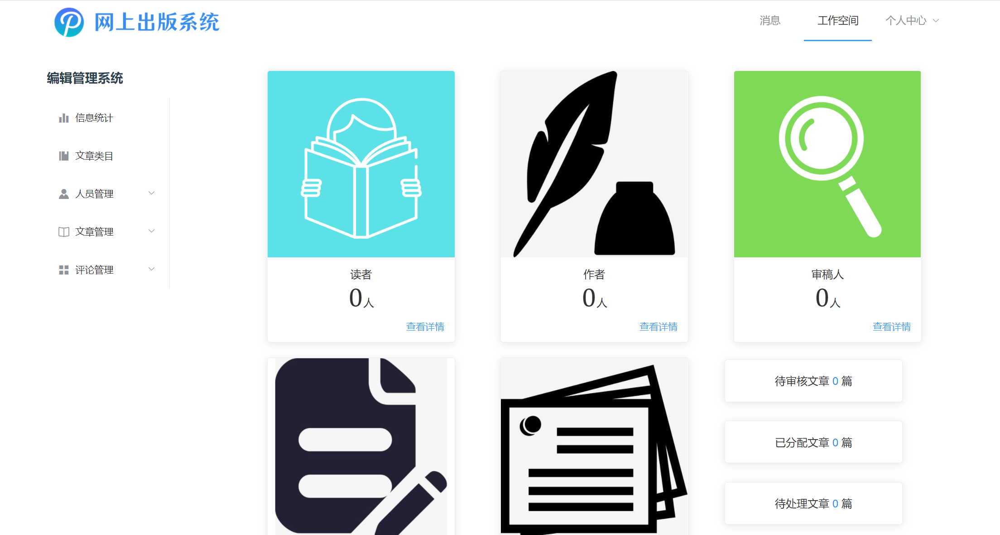

# 网上出版系统前端

 

> 北航 1921 软件工程大作业

后端：[https://github.com/ZewanHuang/Online-Publish-Django](https://github.com/ZewanHuang/Online-Publish-Django)

## 项目介绍

网上出版系统，为读者、作者、审稿人、编辑提供一站式服务。在本站，读者可以查阅已发布文章、申请成为作者，作者可以上传发布文章，审稿人审阅文章并给出评论，编辑统一分配管理。

本项目帮助作者更方便地投稿，促进作者与审稿人的交流，提供编辑统一管理的一体化平台。

## 如何使用

> 此处仅介绍前端运行说明，想运行整个项目配置 [后端](https://github.com/ZewanHuang/Online-Publish-Django)，按各仓库说明配置即可在本地运行。

运行项目前，请先根据提示修改 /src/global/global.vue，以及若您的后端没有跑在本地 8000 端口，需要修改 vue.config.js 文件（文件中已说明清楚）

接下来安装运行项目：

```shell
npm install
npm run serve
```

需要部署时，运行如下命令：

```shell
npm run build
```

## 注意事项

本网站支持在线预览 pdf、word 文档，由于采用 windows 插件，因此只有部署到服务器（即文档公开可访问），才支持在线阅读 word 文档。

## 页面展示

欢迎页面


编辑管理页面



搜索主页


